# praktikum-4-Basis-Data
## Tugas Praktikum
```
1. Tampilkan pegawai yang gajinya bukan 2.000.000 dan 1.250.000 !
2. Tampilkan pegawai yang tunjangannya NULL! 
3. Tampilkan pegawai yang tunjangannya tidak NULL! 
4. Tampilkan/hitung jumlah baris/record tabel pegawai!
5. Tampilkan/hitung jumlah total gaji di tabel pegawai!
6. Tampilkan/hitung rata-rata gaji pegawai!
7. Tampilkan gaji terkecil!
8. Tampilkan gaji terbesar!
```
### 1.Tampilkan pegawai yang gajinya bukan 2.000.000 dan 1.250.000 ! pc1


### 2.Tampilkan pegawai yang tunjangannya NULL! pc2
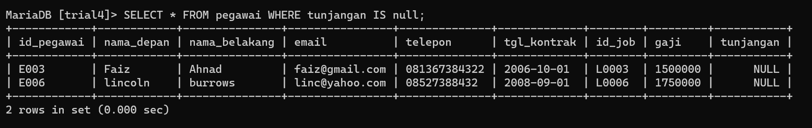

### 3.Tampilkan pegawai yang tunjangannya tidak NULL! pc3
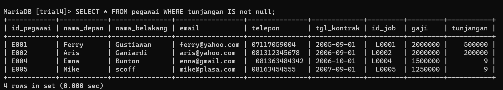

### 4.Tampilkan/hitung jumlah baris/record tabel pegawai! pc4
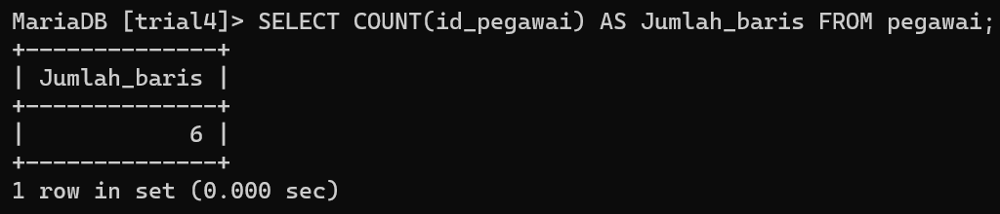

### 5.Tampilkan/hitung jumlah total gaji di tabel pegawai! pc5
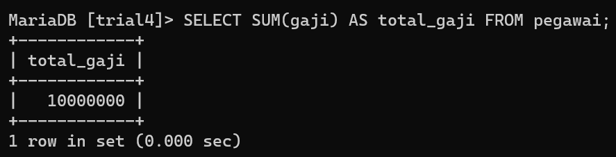

### 6.Tampilkan/hitung rata-rata gaji pegawai! pc6
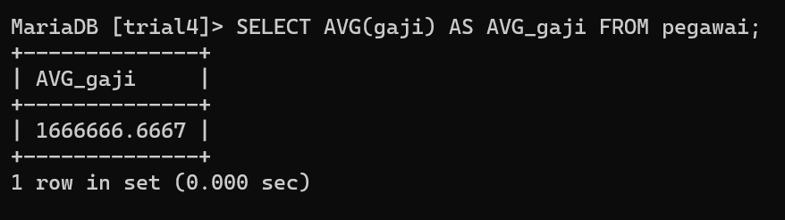

### 7.Tampilkan gaji terkecil! pc7
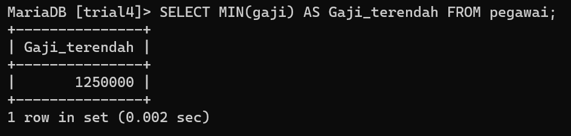

### 8.Tampilkan gaji terbesar! pc8
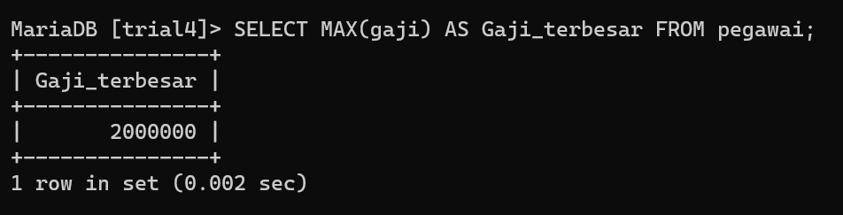

```
1. Tampilkan jumlah hewan yang dimiliki setiap owner.
2. Tampilkan jumlah hewan berdasarkan spesies
3. Tampilkan jumlah hewan berdasarkan jenis kelamin
4. Tampilkan jumlah hewan berdasarkan spesies dan jenis kelamin
5. Tampilkan jumlah hewan berdasarkan spesis (cat dan dog saja) 
dan jenis kelamin
6. Tampilkan jumlah hewan berdasarkan jenis kelamin yang diketahui
saja
```
### 1.Tampilkan jumlah hewan yang dimiliki setiap owner. pct1
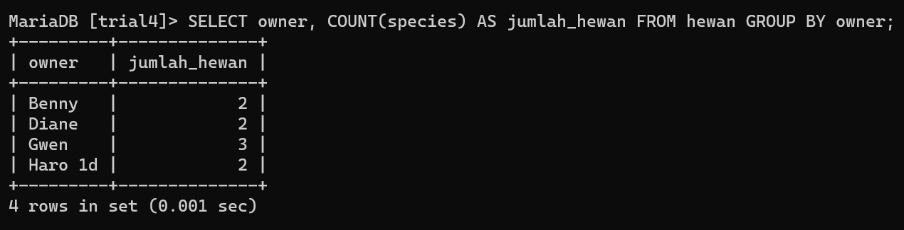
### 2.Tampilkan jumlah hewan berdasarkan spesies pct2
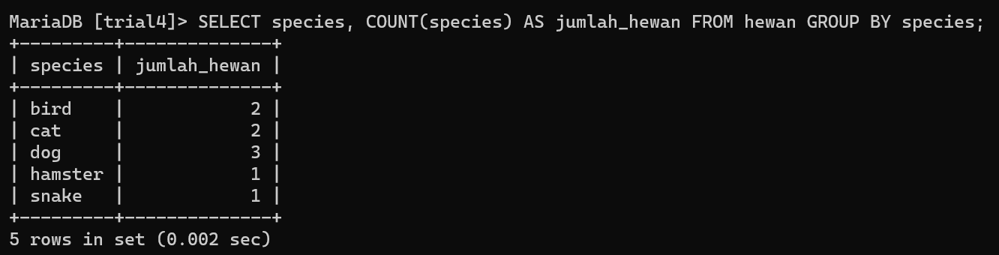
### 3.Tampilkan jumlah hewan berdasarkan jenis kelamin pct3
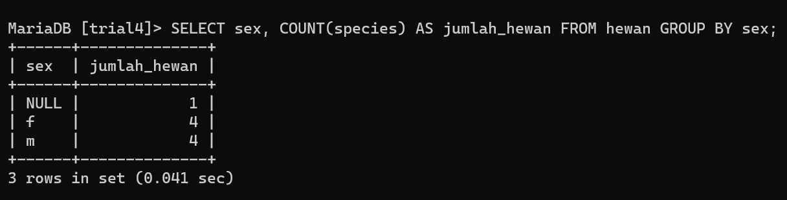
### 4.Tampilkan jumlah hewan berdasarkan spesies dan jenis kelamin pct4
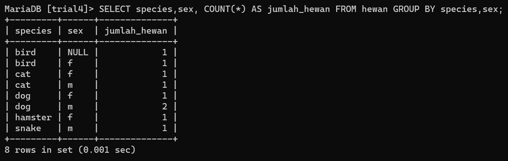
### 5.Tampilkan jumlah hewan berdasarkan spesis (cat dan dog saja) dan jenis kelamin pct5
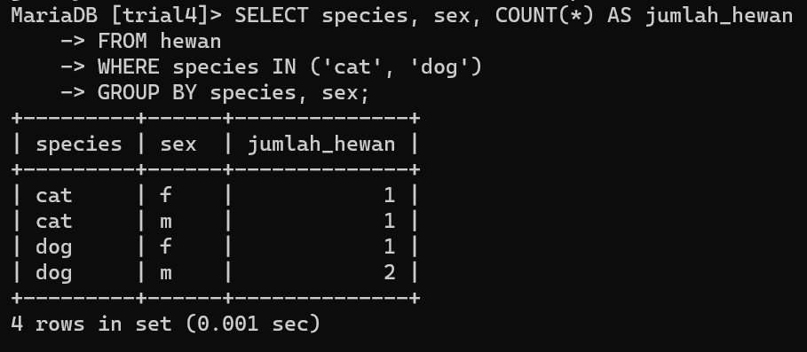
### 6.Tampilkan jumlah hewan berdasarkan jenis kelamin yang diketahui saja pct6
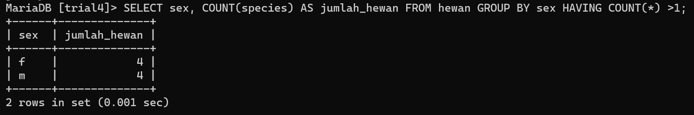

## Kesimpulan
Query filter memungkinkan kita untuk mencari atau memfilter data lebih mudah dan lebih cepat, dengan catatan memberikan kriteria khusus yang cocok dengan database.
